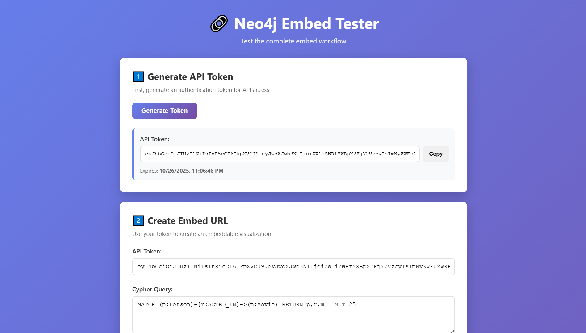
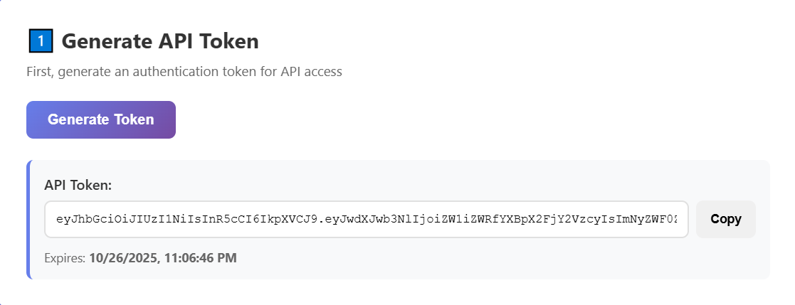
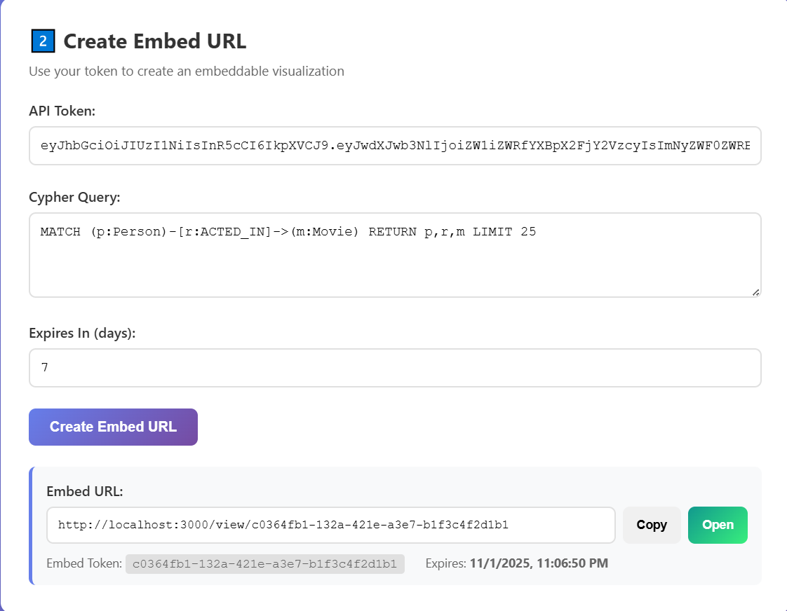
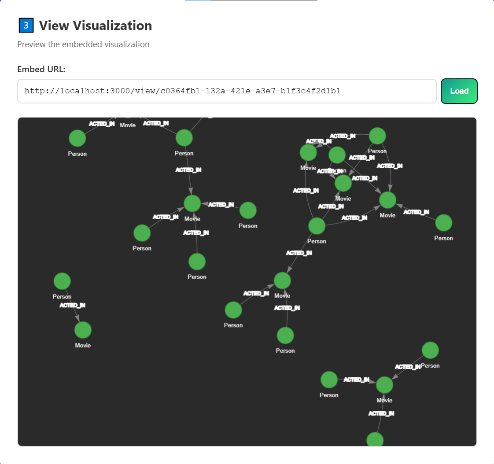
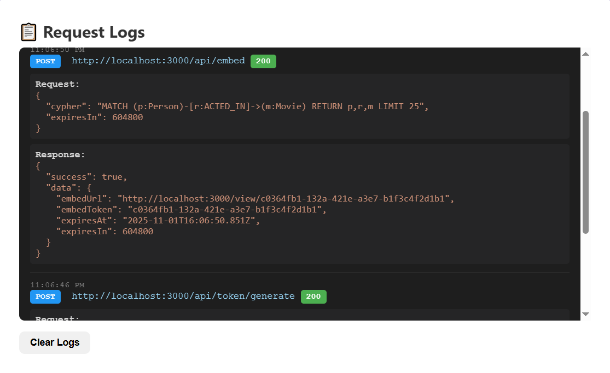

# � Neo4j Embedder

Create embeddable Neo4j graph visualizations with secure token-based access.



## 🎯 What is this?

Generate shareable Neo4j graph visualizations in 3 steps:
1. **Generate API Token** - Get JWT for authentication
2. **Create Embed URL** - Add Cypher query, get shareable link
3. **View Graph** - Interactive visualization with Vis.js

Perfect for dashboards, reports, or sharing Neo4j data without database access.

## ✨ Features

- 🔐 JWT + Embed Token authentication
- 📊 Read-only Neo4j queries via proxy
- 🎨 Interactive Vis.js graph visualization
- ⏰ Time-limited embed tokens (SQLite)
- 🚀 Fast Hono framework
- 📦 Clean architecture (routes → controllers → services → repos)

## 📋 Prerequisites

- Node.js 20+
- Neo4j 5.14+ (bolt://localhost:7687)
- pnpm 8+

## 🚀 Quick Start

```bash
# 1. Install
pnpm install

# 2. Configure .env
NEO4J_URI=bolt://localhost:7687
NEO4J_USER=neo4j
NEO4J_PASSWORD=your_password
JWT_SECRET=your-32-char-secret-key
ALLOWED_ORIGINS=http://localhost:3000
EMBED_BASE_URL=http://localhost:3000

# 3. Run
pnpm dev
```

Server: <http://localhost:3000>

## � How It Works

### Step 1: Generate API Token



```bash
POST /api/token/generate
# Returns JWT (valid 24h)
```

### Step 2: Create Embed URL



```bash
POST /api/embed
Authorization: Bearer <jwt>
{
  "cypher": "MATCH (p:Person)-[r:ACTED_IN]->(m:Movie) RETURN p,r,m LIMIT 25",
  "expiresInDays": 7
}
# Returns: http://localhost:3000/view/{token}
```

### Step 3: View Graph



Share the URL - visualization auto-executes the pre-defined query.

### Request Logs



Track all API calls with full request/response details.

## 📡 API Endpoints

| Method | Endpoint | Auth | Description |
|--------|----------|------|-------------|
| `GET` | `/health` | None | Health check |
| `POST` | `/api/token/generate` | None | Get JWT token |
| `POST` | `/api/embed` | JWT | Create embed URL |
| `GET` | `/view/:token` | None | View visualization |
| `POST` | `/api/proxy/query` | Embed Token | Execute query |
| `GET` | `/api/swagger` | None | API docs |

## 🧪 Test UI

```bash
# Open test frontend
start fe-example/index.html

# Or serve with Python
cd fe-example && python -m http.server 8080
```

## 🗂️ Project Structure

```
src/
├── domain/entities/           # EmbedToken entity
├── infrastructure/
│   ├── database/             # SQLite client
│   ├── repositories/         # EmbedTokenRepository
│   └── services/             # JWTService, Neo4jQueryService
└── presentation/
    ├── controllers/          # Token, Embed, Proxy, Health
    ├── middlewares/          # Auth, CORS, Error
    └── routes/               # API routes
```

## 🔒 Security

- **JWT Auth**: API requires bearer tokens
- **Embed Tokens**: Unique, time-limited, stored in SQLite
- **Read-Only**: Neo4j queries execute in read mode
- **Query Lock**: Tokens store queries (no injection)
- **Auto Expiry**: Tokens expire automatically

## 🛠️ Development

```bash
pnpm dev         # Start with hot reload
pnpm build       # Build TypeScript
pnpm lint        # ESLint check
```

## 📝 Environment Variables

```env
NEO4J_URI=bolt://localhost:7687      # Required
NEO4J_USER=neo4j                      # Required
NEO4J_PASSWORD=password               # Required
JWT_SECRET=min-32-chars               # Required
SQLITE_DB_PATH=./data/embedder.db     # Optional
ALLOWED_ORIGINS=http://localhost:3000 # Required
EMBED_BASE_URL=http://localhost:3000  # Required
PORT=3000                             # Optional
```

## 📚 Tech Stack

- [Hono](https://hono.dev/) - Web framework
- [Neo4j](https://neo4j.com/) - Graph database
- [SQLite](https://sqlite.org/) - Token storage
- [Vis.js](https://visjs.org/) - Graph rendering
- TypeScript + Zod

## 📄 License

MIT

---

Made with ❤️ using Hono + Neo4j


### Environment Variables

```env
# Application
NODE_ENV=development
PORT=3000
HOST=0.0.0.0

# Neo4j
NEO4J_URI=bolt://localhost:7687
NEO4J_USER=neo4j
NEO4J_PASSWORD=your-password
NEO4J_DATABASE=neo4j

# JWT
JWT_SECRET=your-secret-key-min-32-chars
JWT_EXPIRATION=7d
JWT_ALGORITHM=HS256

# Security
BCRYPT_SALT_ROUNDS=12

# CORS
ALLOWED_ORIGINS=http://localhost:3000

# Embed
EMBED_BASE_URL=http://localhost:3000
MAX_TOKEN_EXPIRY_DAYS=90
DEFAULT_TOKEN_EXPIRY_DAYS=7
```

## 📚 API Documentation

### Health Check

```bash
GET /health
```

### Proxy Query

```bash
POST /api/proxy/query
Authorization: Bearer <embed-token>
Content-Type: application/json

{
  "query": "MATCH (n) RETURN n LIMIT 10"
}
```

## 🐳 Docker Commands

```bash
# Build images
pnpm docker:build

# Start services
pnpm docker:up

# View logs
pnpm docker:logs

# Stop services
pnpm docker:down

# Run tests in Docker
pnpm docker:test

# Full cleanup (removes volumes)
pnpm docker:clean
```

See [DOCKER.md](./DOCKER.md) for detailed Docker documentation.

## 📊 Database Scripts

```bash
# Seed sample movie data
pnpm seed

# Clean all test data
pnpm seed:clean
```

## 🏗️ Build & Deploy

### Local Build

```bash
# Build TypeScript
pnpm build

# Start production server
pnpm start
```

### Docker Production

```bash
# Build optimized image
docker build -t hono-neo4j:latest .

# Run container
docker run -p 3000:3000 \
  -e NEO4J_URI=bolt://neo4j:7687 \
  -e NEO4J_PASSWORD=your-password \
  -e JWT_SECRET=your-secret \
  hono-neo4j:latest
```

## 🔒 Security Best Practices

1. **Change default passwords** in production
2. **Use strong JWT secrets** (min 32 characters)
3. **Enable HTTPS** for production deployments
4. **Restrict CORS origins** to your domains
5. **Use environment variables** for sensitive data
6. **Run as non-root user** (handled in Docker)

## 🧰 Development Scripts

```bash
# Development
pnpm dev              # Start with hot reload
pnpm build            # Build TypeScript
pnpm start            # Start production

# Code Quality
pnpm lint             # Check code style
pnpm lint:fix         # Fix lint errors
pnpm format           # Format code
pnpm type-check       # TypeScript check

# Testing
pnpm test             # Run all tests
pnpm test:e2e         # E2E tests only
pnpm test:coverage    # With coverage
pnpm test:watch       # Watch mode

# Database
pnpm seed             # Seed sample data
pnpm seed:clean       # Clean test data

# Docker
pnpm docker:up        # Start services
pnpm docker:down      # Stop services
pnpm docker:test      # Run tests
pnpm docker:clean     # Full cleanup
```

## 📖 Documentation

- [Docker Guide](./DOCKER.md) - Complete Docker deployment guide
- [Testing Guide](./tests/README.md) - E2E testing documentation
- [API Reference](./docs/API.md) - API endpoints (coming soon)

## 🤝 Contributing

1. Fork the repository
2. Create feature branch (`git checkout -b feature/amazing-feature`)
3. Commit changes (`git commit -m 'Add amazing feature'`)
4. Push to branch (`git push origin feature/amazing-feature`)
5. Open Pull Request

## 📝 License

MIT License - see [LICENSE](./LICENSE) file

## 🙏 Acknowledgments

- [Hono](https://hono.dev/) - Ultra-fast web framework
- [Neo4j](https://neo4j.com/) - Graph database
- [Neovis.js](https://github.com/neo4j-contrib/neovis.js/) - Graph visualization
